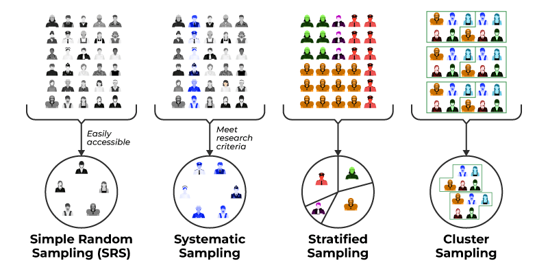
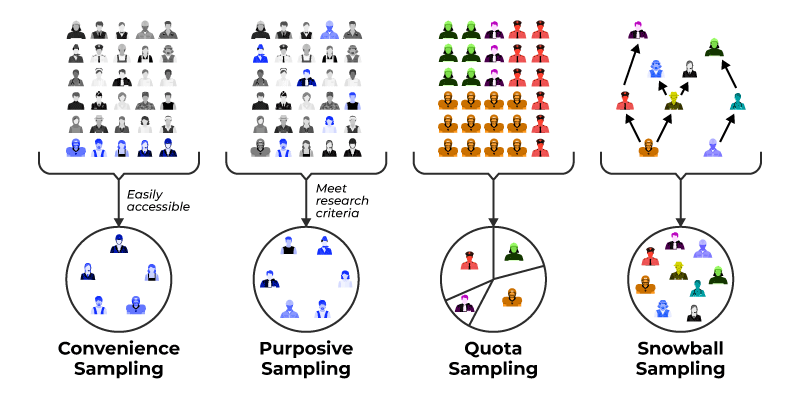

# Statistics 

Statistics is the branch of mathematics that deals with collecting, organizing, analyzing, interpreting, and presenting data to support decision-making and understand patterns or relationships.

🧭 **Broad Categories of Statistics:**

- 1️⃣ **Descriptive Statistics:** Descriptive statistics summarize and describe the main features of a dataset. Key Techniques are:
   - **Measures of Central Tendency:** Mean, Median,
   - **Mode Measures of Dispersion (Spread):** Range, Variance, Standard Deviation,
   - **Interquartile Range Measures of Shape:** Skewness, Kurtosis
   - **Graphical Methods:** Histograms, Pie Charts, Box Plots, Bar Charts, Scatter Plots

- 2️⃣ **Inferential Statistics:** Inferential statistics make predictions, decisions, or generalizations about a population based on sample data. Key concepts are:
    - Population vs. Sample
    - Sampling Techniques (Random, Stratified, Cluster, Systematic)
    - Estimation (Point and Interval Estimates)
    - Hypothesis Testing
    - Confidence Intervals
    - p-values & Significance Levels
    - Errors (Type I and Type II)

> The primary goal of statistics is to make inferences about a population based on a sample of data. This involves using various statistical methods and techniques to analyze the data and draw conclusions about the population. 

## Population vs. Sample 

- A population is the entire group that you want to draw conclusions about.
- A sample is the specific group that you will collect data from. The size of the sample is always less than the total size of the population.

- **Example:** let's say we are interested in studying the average height of all adults in a certain country. The population in this case would be all adults in that country, while a sample would be a group of randomly selected adults from that country who we actually measure and collect data on.

### Difference between Population and sample

|  | Population | Sample |
| --- | --- | --- |
| Definition | The entire group of individuals, objects, or events that we are interested in studying. | A subset of the population that we actually collect data on. |
| Size | Usually very large, can be infinite. | Smaller than the population, usually less than 10% of the population. |
| Selection | All members of the population are potentially included in the study. | Members of the population are selected to be included in the study. |
| Characteristics | Parameters of the population can be determined with complete accuracy. | Statistics of the sample can be used to make inferences about the parameters of the population. |
| Importance | The ultimate goal of statistical inference is to make accurate statements about the population. | The sample is used to estimate characteristics of the population when it is impractical or impossible to study the entire population. |
| Example | All dogs in a certain city. | A randomly selected group of 100 dogs from that city. |

## Sampling Methods

### I. Probability sampling methods

Sampling methods refer to the techniques used to select a subset of individuals or units from a population to gather information. Here are some common sampling methods:

1. **Simple random sampling:** In this method, each individual in the population has an equal chance of being selected for the sample. This can be done using a random number generator or by using a table of random numbers.

    **Example:** A researcher selects 100 students from a university's list of registered students by using a random number generator to pick the names.

2. **Stratified sampling:** This method involves dividing the population into subgroups or strata based on a characteristic of interest (such as age or income level) and then selecting a random sample from each stratum. This ensures that the sample is representative of the population with respect to the characteristic of interest.

    **Example:** A pollster divides the population of a city into age groups and then selects a random sample of 50 individuals from each age group.
    
3. **Cluster sampling:** In this method, the population is divided into clusters or groups, and then a random sample of clusters is selected. All individuals in the selected clusters are included in the sample. This method is often used when it is difficult or costly to obtain a complete list of all individuals in the population.

    **Example:** A public health researcher selects a random sample of 10 clinics from a list of all clinics in a particular region, and then collects data from all patients who visit those clinics during a certain period.

4. **Systematic sampling:** This method involves selecting every nth individual from a list of the population. For example, if we want to select a sample of 100 individuals from a population of 1000, we would select every 10th individual from the list.

    **Example:** A survey researcher selects every 5th customer who enters a store during a particular hour to ask them about their shopping experience.

5. **Convenience sampling:** This method involves selecting individuals who are readily available or easy to reach, such as using participants who are nearby or who respond to an online survey. However, this method may introduce bias as the sample may not be representative of the population.

    **Example:** A college student hands out surveys to their classmates who are available in the classroom.

6. **Snowball sampling:** This method is often used when the population is difficult to reach or identify. It involves selecting individuals who meet certain criteria and then asking them to identify others who also meet those criteria, and so on. This method can be useful for studying rare or hard-to-reach populations.

    **Example:** A researcher studies the social networks of drug users by selecting a few initial individuals and asking them to identify other drug users they know, and so on.

    

    [Image reference](https://www.geeksforgeeks.org/data-science/probability-sampling/)

### II. Non Probability sampling methods

Non-probability sampling methods are techniques for selecting a sample from a population in a non-random way. This means that every member of the population does not have an equal chance of being included in the sample. Non-probability sampling methods are generally used when it is difficult or impractical to obtain a random sample, such as when the population is small, hard to define, or not easily accessible. Here are some common non-probability sampling methods:

1. **Convenience sampling:** This method involves selecting individuals who are readily available or easy to reach, such as using participants who are nearby or who respond to an online survey. However, this method may introduce bias as the sample may not be representative of the population.

    **Example:** A researcher conducts a survey on campus by handing out questionnaires to students who happen to be walking by.

2. **Quota sampling:** This method involves selecting a sample that matches certain characteristics of the population, such as age, gender, or ethnicity. The sample is selected until a predetermined number of individuals in each category are included.
    
    **Example:** A market research firm wants to survey 100 individuals about a new product. They decide to include 50 men and 50 women in the sample.

3. **Purposive sampling:** This method involves selecting individuals who are believed to be typical of the population or who have specific characteristics that are of interest to the researcher.

    **Example:** A researcher studying eating habits selects a sample of individuals who are known to be vegetarian.

4. **Snowball sampling:** This method is often used when the population is difficult to reach or identify. It involves selecting individuals who meet certain criteria and then asking them to identify others who also meet those criteria, and so on. This method can be useful for studying rare or hard-to-reach populations.

    **Example:** A researcher studying a particular subculture selects a few initial individuals and asks them to identify other members of the subculture they know, and so on.

5. **Judgmental sampling:** This method involves selecting individuals based on the researcher's judgment and expertise about the population.
    
    **Example:** A political pollster selects a sample of individuals who are likely to vote for a particular candidate based on their knowledge of the political climate.

In summary, non-probability sampling methods are useful when it is difficult or impractical to obtain a random sample. However, these methods may introduce bias and may not be representative of the population. It is important to carefully consider the strengths and limitations of different sampling methods when designing a study.

[Image reference](https://www.geeksforgeeks.org/data-science/non-probability-sampling/)

