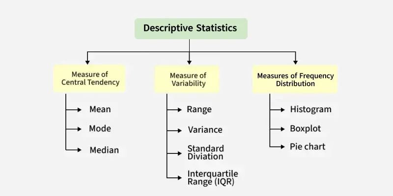
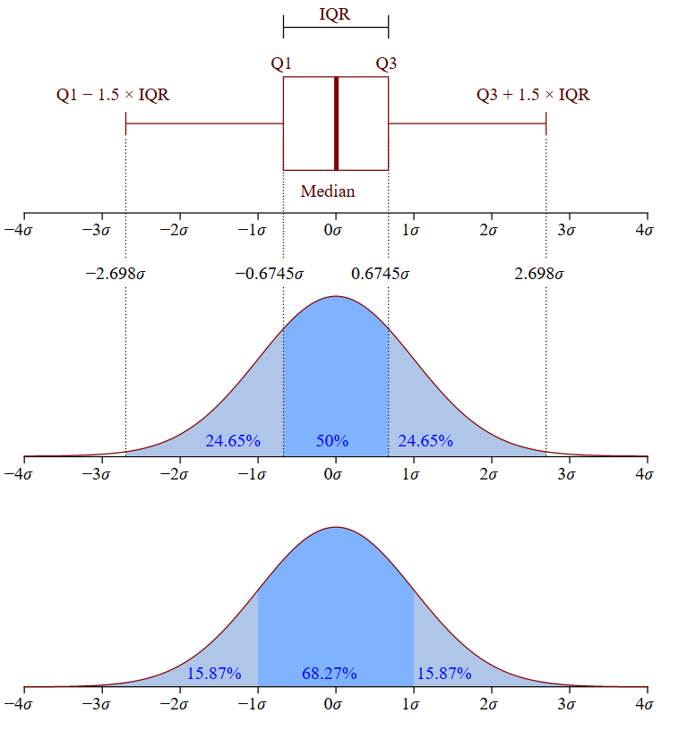
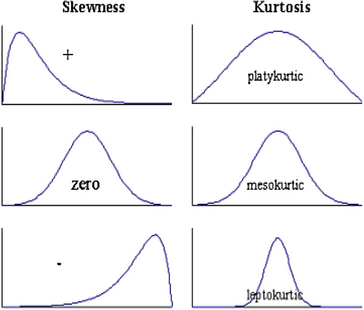

# Descriptive statistics 

Descriptive statistics is a branch of statistics that deals with the collection, organization, analysis, and presentation of data. It involves summarizing and describing the main features of a dataset, such as the central tendency, variability, and distribution of the data.

Some common measures of descriptive statistics include:

1. **Measures of central tendency:** These include the 
    - mean, 
    - median, and 
    - mode,
     
    which represent the average or typical value of the data.

2. **Measures of variability:** These include the 
    - range, 
    - variance, and 
    - standard deviation, 

    which measure the spread or variability of the data.

3. **Measures of distribution:** These include the 
    - skewness and 
    - kurtosis, 

    which describe the shape of the distribution of the data.

Descriptive statistics are often used to summarize and describe data in a way that is easily understandable and interpretable. They can be used to make comparisons between groups, identify patterns or trends in the data, and to detect outliers or anomalies that may need further investigation.

Descriptive statistics are commonly used in fields such as business, economics, psychology, sociology, and healthcare, among others. They are an important tool for making informed decisions and drawing meaningful conclusions from data.

---

## 1. Measures of central tendency

Measures of central tendency are statistical measures that represent the typical or central value of a dataset. They are used to summarize and describe the main features of the data and to make comparisons between different groups or distributions.

There are three main measures of central tendency:

1. **Mean:** The mean is the arithmetic average of a dataset and is calculated by adding up all the values in the dataset and dividing by the total number of values. If $x_1$, $x_2$, $x_3$, ..... $x_i$ ...., $x_k$ have frequency $f_1$, $f_2$, $f_3$,…… $f_k$ then 

    $\mu = \sum_i \frac{f_i x_i}{N}$,

    i.e. $\text{Mean} = \frac{\text{sum of all values}}{\text{total number of values}}$
    

    **Example:** if we have a dataset of test scores for a class of students: 70, 80, 90, 85, and 75, we can calculate the mean by adding up all the scores and dividing by the total number of scores: Mean = (70 + 80 + 90 + 85 + 75) / 5 = 80. So the mean test score for the class is 80.

    The mean is commonly used in statistics to summarize and describe a dataset, and is often used as a benchmark for making comparisons between different groups or distributions. However, the mean can be affected by extreme values or outliers, which can skew the results. In such cases, it may be more appropriate to use other measures of central tendency, such as the median or mode, to represent the typical or central value of the dataset.

2. **Median:** The median is the middle value of a dataset when the values are arranged in order of magnitude. It is used to represent the typical or central value when the data are skewed or have outliers.

    - **How to calculate?:** To calculate the median, follow these steps:

    1. Arrange the values in the dataset in order from smallest to largest (or vice versa).
    2. If the dataset has an odd number of values, the median is the middle value. For example, in the dataset {1, 3, 5, 7, 9}, the median is 5 because it is the middle value.
    3. If the dataset has an even number of values, the median is the average of the two middle values. For example, in the dataset {1, 3, 5, 7, 9, 11}, the two middle values are 5 and 7, so the median is (5+7)/2 = 6.

    The median is a useful measure of central tendency for datasets that have outliers or extreme values, as it is less sensitive to these values than the mean. Additionally, the median is appropriate for ordinal data, where the values have an inherent order but the distance between values is not meaningful (e.g. ranks, grades).

3. **Mode:** The mode is the value that occurs most frequently in a dataset. It is used to represent the most common or typical value when the data are categorical or have a discrete distribution. Unlike mean and median, the mode does not take into account the actual numerical values of the data points, but only their frequencies.

    - **How to calculate?:** The mode can be calculated for any type of data, including nominal, ordinal, interval, and ratio data. In a dataset with a single mode, there is only one value that occurs more frequently than any other value. However, it is also possible to have datasets with multiple modes, where there are several values that occur with the same highest frequency.

        - **Nominal data:** In nominal data, each value represents a category or a label, such as colors or types of fruits. To find the mode, simply identify the category that occurs most frequently in the dataset.
        - **Ordinal data:** In ordinal data, each value represents a category that can be ordered or ranked, such as levels of education or ranks in a competition. To find the mode, identify the category with the *highest frequency*.
        - **Interval or ratio data:** In interval or ratio data, each value represents a numerical quantity, such as heights or weights. To find the mode, first group the data into intervals or bins, then identify the interval with the *highest frequency*. If there are multiple intervals with the same highest frequency, the mode is considered to be multimodal.

        **Example:** Here is an example of how to calculate the mode for a dataset of heights:

        1. Sort the dataset in ascending order: 62, 64, 66, 66, 68, 68, 68, 70, 70, 72.

        2. Count the frequency of each value: 62 (1), 64 (1), 66 (2), 68 (3), 70 (2), 72 (1).

        3. Identify the value with the highest frequency: 68.

        4. The mode of the dataset is 68, indicating that 68 is the most common height in the dataset.

        Note that in some cases, a dataset may not have a mode if all the values occur with the same frequency. In other cases, the mode may not be a meaningful measure of central tendency if there are extreme values or outliers that skew the distribution.
        
    - The mode is often used in conjunction with other measures of central tendency, such as mean and median, to gain a better understanding of the underlying distribution of the data. It is especially useful for describing skewed distributions, where the mean and median may not accurately represent the central tendency of the data.

The choice of which measure of central tendency to use depends on the nature of the data and the research question. The mean is commonly used when the data are normally distributed and have a symmetrical distribution. The median is used when the data are skewed or have outliers. The mode is used when the data are categorical or have a discrete distribution.

Measures of central tendency are an important tool for summarizing and describing data and for making comparisons between different groups or distributions. However, they should be used in conjunction with other statistical measures, such as measures of variability and distribution, to provide a more complete picture of the data.

---

## 2. Measures of variability

Measures of variability are statistical measures that describe the spread or dispersion of a dataset. Some common measures of variability include:

- **Range:** The range is the difference between the maximum and minimum values in a dataset. It is the simplest measure of variability but can be heavily influenced by outliers. It is calculated using the formula:

    $\text{Range} = \text{max value} - \text{min value}$

    **Example:** if a dataset consists of the following values: 2, 5, 7, 8, 12, the range would be calculated as:

    Range = 12 - 2 = 10

- **Variance:** The variance measures how much the values in a dataset vary from the mean. It is calculated by taking the average of the squared differences between each value and the mean. It is calculated using the formula:

    $\text{Variance} = \sum \frac{(x-\mu)^2}{n}$

    Variance is commonly used in statistical analysis and can be influenced by extreme values.

    where $\sum$ represents the sum of, $x$ represents each value in the dataset, $\mu$ represents the mean of the dataset, and $n$ represents the number of values in the dataset.

    **Example:** If a dataset consists of the following values: 10, 15, 20, 25, 30, and the mean is calculated to be 20, the variance would be calculated as:

    Variance = [(10-20)² + (15-20)² + (20-20)² + (25-20)² + (30-20)²] / 5 = 200 / 5 = 40

- **Standard deviation:** Standard deviation is a measure of how spread out a set of data is from its mean or average. It tells you how much the data deviates from the average. A low standard deviation indicates that the data is clustered closely around the mean, while a high standard deviation indicates that the data is spread out over a larger range of values. It is a commonly used measure of variability and is often preferred over the variance because it is expressed in the same units as the original data. The formula for standard deviation is:

    $\sigma = \sqrt{\frac{\sum (x-\mu)^2}{n}}$

    (Standard deviation of the population)

    where:

    - $\sigma$ is the standard deviation
    - $\sum$ is the sum of all the data points
    - $x$ is each individual data point
    - $\mu$ is the mean or average of the data
    - $n$ is the total number of data points

    **Method:** To find the standard deviation, you first subtract each data point from the mean, square the result, sum up all the squared differences, divide by the total number of data points, and finally, take the square root of the result.

    **Example:** let's say you have the following set of data: {2, 4, 6, 8, 10}. 
    - First, find the mean: $\mu = (2 + 4 + 6 + 8 + 10) / 5 = 6$. 
    - Next, calculate the difference between each data point and the mean: (2 - 6) = -4, (4 - 6) = -2, (6 - 6) = 0, (8 - 6) = 2, (10 - 6) = 4. 
    - Then, square each of these differences and add up all the squared differences: (-4)² = 16, (-2)² = 4, (0)² = 0, (2)² = 4, (4)² = 6.
    - Divide by the total number of data points: 16 + 4 + 0 + 4 + 16 = 40.
    - Finally, take the square root of the result: 40 / 5 = 8.
    - So, the standard deviation of this set of data is approximately 2.83.

- **Interquartile range (IQR):** The IQR is the difference between the third quartile (the value above which 75% of the data falls) and the first quartile (the value below which 25% of the data falls). It is a measure of the spread of the middle 50% of the data and is less influenced by extreme values than the range.

    The formula for calculating the IQR is as follows:

    $\text{IQR} =Q_3 -Q_1$

    Where $Q_3$ is the third quartile and $Q_1$ is the first quartile. The quartiles are calculated by dividing the dataset into four equal parts. The first quartile (i.e. $Q_1$) represents the 25th percentile of the dataset, and the third quartile (i.e. $Q_3$) represents the 75th percentile.

    

    **Example:** Consider the following dataset: 1, 3, 5, 6, 7, 8, 9, 10, 11, 15. 
    - The first quartile ($Q_1$) is 4 and the third quartile ($Q_3$) is 10. Therefore, the IQR is:
    $IQR = Q_3 - Q_1 = 10 - 4 = 6$
    - This means that the middle 50% of the dataset (between the 25th and 75th percentiles) falls within a range of 6.

    > **Quartiles:** Quartiles are a way to divide a dataset into four equal parts or quarters. Quartiles are used to understand the distribution of a dataset and to calculate other measures of variability such as the interquartile range.
    > There are three quartiles that divide a dataset into four parts:
    >   - The first quartile ($Q_1$) is the 25th percentile of the dataset. It divides the dataset into the bottom 25% and the top 75%.
    >   - The second quartile ($Q_2$) is the median of the dataset. It divides the dataset into two equal parts.
    >   - The third quartile ($Q_3$) is the 75th percentile of the dataset. It divides the dataset into the bottom 75% and the top 25%.
    > To calculate the quartiles, the dataset must be sorted in ascending order. The formula for finding the quartiles depends on the number of observations in the dataset. Here are the general formulas:
    >   - $Q_1$ = ($n+1$)/4th observation
    >   - $Q_2$ = ($n+1$)/2th observation
    >   - $Q_3$ = 3($n+1$)/4th observation
    > where $n$ is the total number of observations in the dataset.
    > The quartiles are significant because they provide important information about the distribution of the data. They help us to understand the spread and central tendency of the dataset. The interquartile range, which is the difference between the third and first quartiles, is a measure of variability that is useful for identifying outliers and understanding the spread of the data. In addition, quartiles can be used to create box plots, which are a graphical representation of the distribution of the data.

- **Mean absolute deviation (MAD):** The mean absolute deviation (MAD) is a measure of variability that indicates how much the observations in a dataset deviate, on average, from the mean of the dataset. The MAD is the average of the absolute differences between each value and the mean. It is a robust measure of variability that is less sensitive to outliers than the variance and standard deviation.

    **Formula:** MAD is calculated by finding the absolute difference between each data point and the mean, then taking the average of those absolute differences. The formula for calculating MAD is as follows:

    $\text{MAD} = \frac{1}{n}\sum_i^n |x_i - \mu|$

    Where $n$ is the number of observations in the dataset, $x_i$ is the value of the ith observation, $\mu$ is the mean of the dataset, and $\sum$ represents the sum of the absolute differences.

    **Example:** For example, consider the following dataset: 2, 3, 5, 6, 7, 8, 9, 10, 11, 15

    To calculate the MAD, we first find the mean of the dataset:

    $\mu$ = (2 + 3 + 5 + 6 + 7 + 8 + 9 + 10 + 11 + 15) / 10 = 7.6

    Next, we find the absolute difference between each data point and the mean: |2 - 7.6| = 5.6, |3 - 7.6| = 4.6, |5 - 7.6| = 2.6, |6 - 7.6| = 1.6, |7 - 7.6| = 0.6, |8 - 7.6| = 0.4, |9 - 7.6| = 1.4, |10 - 7.6| = 2.4, |11 - 7.6| = 3.4, |15 - 7.6| = 7.4.

    Then we take the average of those absolute differences:

    MAD = (1/10) * (5.6 + 4.6 + 2.6 + 1.6 + 0.6 + 0.4 + 1.4 + 2.4 + 3.4 + 7.4) = 3.34

    The MAD for this dataset is 3.34, which means that, on average, each observation deviates from the mean by approximately 3.34.

These measures of variability are useful in providing information about how much the values in a dataset vary from each other. The appropriate measure to use depends on the specific characteristics of the data and the research question being asked.

---

## 3. Measures of distribution

Skewness and kurtosis are two statistical measures used to describe the shape of a probability distribution.

- **Skewness:** Skewness measures the degree of asymmetry in a distribution. A distribution with a positive skewness has a longer tail on the positive side of the mean, while a negative skewness means the tail is longer on the negative side of the mean. A perfectly symmetrical distribution has a skewness of zero.

    

    
    
    

    ([Image credit](https://www.analyticsvidhya.com/blog/2021/08/a-guide-to-complete-statistics-for-data-science-beginners/))

    Here are three common measures of skewness:
    
    1. **Pearson's moment coefficient of skewness:**

        $\text{Skewness} = \frac{3(\text{Mean}-\text{Mode})}{\text{Standard deviation}}$.

        This is the formula described above that uses the third moment of the distribution to measure skewness.
    
    2. **Sample skewness:** This is a formula that uses the sample mean, standard deviation, and third central moment to estimate the skewness of the distribution. The formula for sample skewness is:

        $\text{Skewness} = \frac{n}{(n - 1) * (n - 2)}\times \left(\frac{\sum(x_i - \mu)^3}{\sigma_s^3}\right)$     
        
        (known as Fisher-Pearson standardized moment coefficient)

        where $n$ is the sample size, $\mu$ is the sample mean, $x_i$ is the $i-th$ observation in the sample, and $\sigma_s$ is the sample standard deviation.

        > **Sample standard deviation:** The sample standard deviation measures the spread of the data around the mean. It tells you how much the individual data points deviate from the mean, on average. Note that the sample standard deviation is calculated using $n - 1$ in the denominator instead of $n$, which is known as Bessel's correction. This is because using $n$ instead of $n - 1$ tends to underestimate the true variance of the population from which the sample was drawn.
        > 
        > Formula: $\sigma_s = \sqrt{\frac{\sum_i^n (x_i-\mu)}{n-1}}$
        >
        > Care should be taken when getting the standard deviation because the standard deviation is different from the standard deviation of a sample. If the problem describes a situation dealing with a sample or subset of a group, then the sample standard deviation, s, should be used.

        **How to Transform Skewed Data?** The graph of skewed data may be transformed into a symmetrical, balanced bell curve shape by changing the data using various methods. The selection of which method to use depends on the characteristic of the data set and its behavior. Here are the most common ways of correcting the skewness of data distribution:

        - **Logarithmic transformation:** If the data are positively skewed (i.e., skewed to the right), taking the logarithm of the data can help to reduce the skewness. This can be especially useful when dealing with data that are highly variable and cover a wide range of values. A logarithmic transformation compresses the higher values and stretches the lower values, so the distribution can become more symmetrical.
        - **Square root transformation:** Similar to the logarithmic transformation, taking the square root of the data can also help to reduce positive skewness. This transformation can be useful when the values are strictly positive and the range of values is limited.
        - **Inverse transformation:** In some cases, taking the reciprocal of the data (i.e., 1/x) can help to reduce negative skewness (i.e., skewed to the left). This transformation can be useful when the values are strictly positive and the distribution is highly skewed.
        - **Box-Cox transformation:** The Box-Cox transformation is a family of power transformations that can be used to adjust the shape of a distribution to be more normal. The transformation involves raising the data to a power (λ), which is chosen to optimize the normality of the distribution. The optimal value of λ can be found through maximum likelihood estimation.

        It is important to note that transforming the data may not always be necessary or appropriate. The choice of transformation depends on the distribution of the data, the research question, and the statistical model being used. In addition, some transformations may change the interpretation of the data, so it is important to carefully consider the implications of any transformations before applying them.

        **Why transformation is done?:** Transformation is required for a skewed data for several reasons:

        - **To meet statistical assumptions:** Many statistical analyses assume that the data are normally distributed. Skewed data violate this assumption and can lead to biased or incorrect results. Transforming the data can make it more normally distributed and improve the validity of the analysis.
        - **To improve interpretability:** Skewed data can be difficult to interpret and can make it hard to compare different groups or variables. Transforming the data can make the distribution more symmetrical and easier to understand.
        - **To reduce the influence of outliers:** Skewed data can be particularly sensitive to outliers, which can have a large impact on the mean and standard deviation. Transforming the data can reduce the influence of outliers and make the analysis more robust.
        - **To improve model performance:** In some cases, transforming the data can improve the performance of statistical models. For example, linear regression models assume that the residuals are normally distributed. Transforming the response variable or predictor variables can improve the normality of the residuals and improve the model fit.
        
        It's important to note that not all skewed data require transformation. The decision to transform the data depends on the specific research question, the nature of the data, and the statistical model being used. In some cases, it may be more appropriate to use non-parametric methods that do not rely on the assumption of normality.
    
    3. **Quartile skewness:** This measure of skewness is based on the difference between the median and the mode of the distribution. Specifically, the quartile skewness is defined as:

        $\text{Skewness} = \frac{Q_1 + Q_3 - 2 * \text{median}}{Q_3 - Q_1}$

        where $Q_1$ and $Q_3$ are the first and third quartiles of the distribution, and the median is the second quartile.
    
    Each of these measures of skewness has its own strengths and weaknesses, and the choice of measure may depend on the context and purpose of the analysis.

- **Kurtosis:** Kurtosis is a statistical measure that describes the shape of a distribution by measuring the degree of peakedness or flatness of the distribution compared to the normal distribution. A distribution with high kurtosis indicates that the data have many outliers or extreme values, while a distribution with low kurtosis indicates that the data are more spread out and have fewer outliers.

    **How to calculate kurtosis:** Mathematically speaking, kurtosis is the standardized fourth moment of a distribution. Moments are a set of measurements that tell you about the shape of a distribution.

    Moments are standardized by dividing them by the standard deviation raised to the appropriate power.

    - **Kurtosis of a population:** The following formula describes the kurtosis of a population:
    
        Kurtosis = $\tilde{\mu}_4 = \frac{\mu_4}{\sigma^4}$. 

        Where:

        - $\tilde{\mu}_4$ is the standardized fourth moment
        - $\mu_4$ is the unstandardized central fourth moment
        - $\sigma$ is the standard deviation

    - **Kurtosis of a sample:** The kurtosis of a sample is an estimate of the kurtosis of the population.

        It might seem natural to calculate a sample’s kurtosis as the fourth moment of the sample divided by its standard deviation to the fourth power. However, this leads to a biased estimate.

        The formula for the unbiased estimate of excess kurtosis includes a lengthy correction based on the sample size:

        kurtosis $ = \frac{(n+1)(n-1)}{(n-1)(n-3)}\frac{\sum (x_i -\mu)^4}{(\sum (x_i - \mu)^2)^2}- 3\frac{(n-1)^2}{(n-2)(n-3)}$

        Where

        - $n$ is the sample size
        - $x_i$ are observations of the variable x
        - $\mu$ is the mean of the variable x.

    **Types of kurtosis:** Examples of kurtosis include:

    1. **Mesokurtic distribution:** A mesokurtic distribution has a kurtosis value of zero and is similar in shape to the normal distribution. It has a moderate degree of peakedness and is neither too flat nor too peaked.

    2. **Leptokurtic distribution:** A leptokurtic distribution has a kurtosis value greater than zero and is more peaked than the normal distribution. It has heavier tails and more outliers than a normal distribution.

    3. **Platykurtic distribution:** A platykurtic distribution has a kurtosis value less than zero and is flatter than the normal distribution. It has fewer outliers and less extreme values than a normal distribution.

     

    It's important to note that kurtosis can only be interpreted in the context of the specific distribution being analyzed. A high or low kurtosis value does not necessarily indicate that the data are problematic or that any action needs to be taken. Rather, kurtosis can provide insight into the shape of the distribution and can help to identify potential issues with the data.
    

---

# Probability distributions and hypothesis testing

## Probability

- Probability is a subject that deals with uncertainty. 
- In everyday terminology, probability can be thought of as a numerical measure of the likelihood that a particular event will occur.
- Probability values are assigned on a scale from `0` to `1`, with values near `0` indicating that an event is unlikely to occur and those near `1` indicating that an event is likely to take place.
- Suppose that an event `E` can happen in `h` ways out of a total of `n` possible equally likely ways. Then the probability of occurrence of the event (called its success) is denoted by
    
    $p=Pr\{E\}=\frac{h}{n} ~~~~~~~~~~~~~~~$ (success probability)

- The probability of non-occurrence of the event (called its failure) is denoted by

    $𝑞=1−𝑝 \rightarrow 𝑝+𝑞=1 $

### Conditional probability; Independent and dependent events

- If $E_1$ and $E_2$ are two events, the probability that $E_2$ occurs given that $E_1$ has occurred is denoted by $Pr\{E_2|E_1\}$, or $Pr\{E_2 ~\text{given} ~E_1\}$, and is called the conditional probability of $E_2$ given that $E_1$ has occurred.

- If the occurrence or non-occurrence of $E_1$ does not affect the probability of occurrence of $E_2$, then Pr{$E_2$ | $E_1$}=Pr{$E_2$} and we say that $E_1$ and $E_2$ are independent events, they are dependents.

- If we denote by ( $E_1$ $E_2$) the event that "both $E_1$ and $E_2$ occur,’’ sometimes called a compound event, then

    Pr{ $𝐸_1$ $𝐸_2$ } = Pr{ $𝐸_1$ } Pr{ $𝐸_2$ | $𝐸_1$ }

- Similarly for three events $(𝐸_1 𝐸_2 𝐸_3)$ 

    Pr{ $𝐸_1$ $𝐸_2$ $𝐸_3$ } = Pr{ $𝐸_1$ } Pr{ $𝐸_2$ | $𝐸_1$ } Pr{ $𝐸_3$ | $𝐸_2$ $𝐸_1$ }

    If these events are independent, then 

    Pr{ $𝐸_1$ $𝐸_2$ } = Pr{ $𝐸_1$ } Pr{ $𝐸_2$ }.

    Similarly 

    Pr{ $𝐸_1$ $𝐸_2$ $𝐸_3$}=Pr{ $𝐸_1$ } Pr{ $𝐸_2$ } Pr{ $𝐸_3$}.

### Mutually exclusive events

- Two or more events are called mutually exclusive if the occurrence of any one of them excludes the occurrence of the others. Thus if $E_1$ and $E_2$ are mutually exclusive events, then

    Pr{ $𝐸_1$ $𝐸_2$ } = 0.

- If $E_1 + E_2$ denotes the event that ‘‘either $E_1$ or $E_2$ or both occur’’, then

    Pr{ $𝐸_1$ + $𝐸_2$ } = Pr{ $𝐸_1$ } + Pr{ $𝐸_2$ } − Pr{ $𝐸_1$ $𝐸_2$ }.

---

