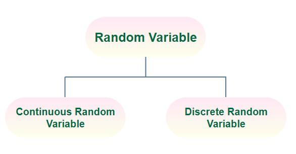

# Probability distributions 

### Random variables

- A random variable is a numerical description of the outcome of a statistical experiment.
- A random variable that may assume only a finite number or an infinite sequence of values is said to be discrete; one that may assume any value in some interval on the real number line is said to be continuous
* Discrete random variables
* Continuous random variables

A probability distribution is a function that describes the likelihood of each possible outcome in a random experiment. Variables that follow a probability distribution are called random variables. In other words, it is a mathematical function that assigns probabilities to all possible outcomes of a random variable.

## Types of probability distributions

There are two types of probability distributions: 

### 1. Discrete

A discrete probability distribution assigns probabilities to a finite or countably infinite number of possible outcomes. There are several types of discrete probability distributions, including:

1. **Bernoulli distribution:** The Bernoulli distribution is a simple probability distribution that describes the probability of success or failure in a single trial of a binary experiment. The Bernoulli distribution has two possible outcomes: success (with probability $p$) or failure (with probability $1-p$). The formula for the Bernoulli distribution is:

    $P(X=x) = p^x \times (1-p)^{(1-x)}$

    where $X$ is the random variable, $x$ is the outcome (either `0` or `1`), and $p$ is the probability of success.

    

2. **Binomial distribution:** The binomial distribution describes the probability of getting a certain number of successes in a fixed number of independent trials of a binary experiment. The binomial distribution has two parameters: $n$, the number of trials, and $p$, the probability of success in each trial. The formula for the binomial distribution is:

    $P(X=x) = ^nC_x ~ p^x ~ (1-p)^{(n-x)}$

    where $X$ is the random variable representing the number of successes, $x$ is the number of successes, $n$ is the number of trials, $p$ is the probability of success, and $^nC_x = \frac{n!}{x! (n-x)!}$ is the binomial coefficient, which represents the number of ways to choose $x$ objects from a set of n objects.

|     Statistics          |       Formula      |
|-------------------------|--------------------|
|            Mean         |        $\mu=n p$   |
|      Variance           | $\sigma^2 = nn p (1-p)$ |
| Standard deviation | $\sigma = \sqrt{n p (1-p)}$ |
| Moment coefficient of skewness | $\alpha_3 = \frac{1-p-p}{\sqrt{n p (1-p)}}$ |
| Moment coefficient of Kurtosis | $\alpha_4 = 3+ \frac{1-6 p (1-p)}{n p (1-p)}$ |

[A link to generate the plot](https://homepage.divms.uiowa.edu/~mbognar/applets/bin.html)

3. **Poisson distribution:** The Poisson distribution is used to describe the probability of a certain number of events occurring in a fixed time interval when the events occur independently and at a constant rate. The Poisson distribution has one parameter: $\lambda$, which represents the expected number of events in the time interval. The formula for the Poisson distribution is:

    $P(X=x) = e^{-λ} \frac{λ^x}{x!}$

    where $X$ is the random variable representing the number of events, $x$ is the number of events, $e$ is the mathematical constant, $\lambda$ is the expected number of events, and $x!$ is the factorial function.

| Statistics     |    Formula   |
|----------------|--------------|
| Mean | $\mu=\lambda $ |
| Variance | $\sigma^2 = \lambda$ |
|Standard deviation | $\sigma = \sqrt{\lambda}$ |
| Moment coefficient of skewness | $\alpha_3 = \frac{1}{\sqrt{\lambda}}$ |
| Moment coefficient of Kurtosis | $\alpha_4 = 3+ \frac{1}{\lambda}$ |

[A link to generate the plot](https://homepage.divms.uiowa.edu/~mbognar/applets/pois.html)

The PMF is a function that gives the probability of each possible value of the random variable. The PMF for the Bernoulli distribution has two values ($p$ and $1-p$), the PMF for the binomial distribution has $n+1$ values (corresponding to the number of successes), and the PMF for the Poisson distribution has an infinite number of values (corresponding to the number of events).

> **probability mass functions (PMFs):** A probability mass function (PMF) is a function that gives the probability of each possible value of a discrete random variable. It is a way of summarizing the probability distribution of a discrete random variable.
> The PMF is defined for all possible values of the random variable and satisfies the following properties:
> 
> - The value of the PMF at any possible value of the random variable is a non-negative number.
> - The sum of the PMF over all possible values of the random variable is equal to one.
>
> The PMF is often represented graphically using a histogram or bar graph. The height of each bar represents the probability of the corresponding value of the random variable.
> 
> **Example:** consider a fair six-sided die. The random variable X can take on values of 1, 2, 3, 4, 5, or 6, each with probability 1/6. The PMF for this random variable is:
> 
> P(X = 1) = 1/6
>
> P(X = 2) = 1/6
>
> P(X = 3) = 1/6
>
> P(X = 4) = 1/6
>
> P(X = 5) = 1/6
>
> P(X = 6) = 1/6
>
> This PMF is illustrated in the following figure:

### 2. Continuous

Continuous probability distributions are used to model continuous random variables, which can take on any value in a given range. Unlike discrete random variables, which take on only a finite or countably infinite set of possible values, continuous random variables can take on an uncountably infinite set of possible values. 

There are several common continuous probability distributions, including:

1. **Normal distribution:** also known as the Gaussian distribution, this is a bell-shaped distribution that is symmetric around the mean. It is commonly used to model measurements that are expected to be normally distributed, such as heights or weights of individuals in a population. The probability density function (PDF) of the normal distribution is:

    $$f(x; μ, σ) = \frac{1}{\sigma \sqrt{2\pi}} \text{Exp}\left(-\frac{(x-\mu)^2}{2\sigma^2}\right)$$

    where $x$ is the random variable, $\mu$ is the mean, $\sigma$ is the standard deviation.

    
    
    **Empirical rule:** The Empirical Rule, also known as the 68-95-99.7 Rule, is a rule of thumb for the normal distribution. It states that:

    - Approximately 68% of the data falls within one standard deviation of the mean.
    - Approximately 95% of the data falls within two standard deviations of the mean.
    - Approximately 99.7% of the data falls within three standard deviations of the mean.

    This means that if a distribution is approximately normal, we can use these percentages to estimate the proportion of data that falls within a certain range of values.

    

    **Example:** if we know that a distribution is approximately normal with a mean of 50 and a standard deviation of 10, we can use the Empirical Rule to estimate the proportion of data that falls within certain ranges:

    - Approximately 68% of the data falls between 40 and 60 (one standard deviation from the mean).
    - Approximately 95% of the data falls between 30 and 70 (two standard deviations from the mean).
    - Approximately 99.7% of the data falls between 20 and 80 (three standard deviations from the mean).

    It's important to note that the Empirical Rule is only an approximation and may not hold for all normal distributions. It is also not applicable to non-normal distributions.

| Statistics | Formula |
|------------|---------|
| Mean | $\mu$ |
| Variance | $\sigma^2 $ |
|Standard deviation | $\sigma $ |
| Moment coefficient of skewness | $\alpha_3 = 0$ |
| Moment coefficient of Kurtosis | $\alpha_4 = 3$ |
| Mean deviation | $\sigma\sqrt{\frac{2}{\pi}} = 0.7979 ~ \sigma $ |

2. **Uniform distribution:** this is a distribution in which all values in a given range are equally likely to occur. The PDF of the uniform distribution is:

    $$f(x)=
    \begin{cases}
    \frac{1}{b-a}, & a \leq x \leq b \\
    0, & \text{otherwise}
    \end{cases}$$

    where $x$ is the random variable, $a$ is the lower bound of the range, and $b$ is the upper bound of the range.

    

3. **Exponential distribution:** this is a distribution that is commonly used to model the time between events that occur at a constant rate. The PDF of the exponential distribution is:

    $$ f(x; \lambda) = 
    \begin{cases} 
    \lambda e^{-\lambda x}, & x \geq 0 \\
    0, & x < 0
    \end{cases} $$ 

    where $x$ is the random variable, and $\lambda$ is the rate parameter.

|Statistics| Formula|
|----------|--------|
| Mean | $𝐸[𝑋]=\frac{1}{\lambda}$ |
| Median | $m[X] =\frac{ln(2)}{\lambda} < E[X]$ |
| Variance | $𝑉𝑎𝑟[𝑋]=\frac{1}{\lambda^2}$ |
| Moments | $E[X^n]=\frac{n!}{\lambda^n}$|

4. **Gamma distribution:** this is a distribution that is used to model the sum of several exponentially distributed random variables. The PDF of the gamma distribution is:

$$f(x; k, \theta) = \frac{x^{k-1} e^{-x/\theta}}{\theta^k \Gamma(k)}$$

where $x$ is the random variable, $k$ is the shape parameter, $\theta$ is the scale parameter, and $\Gamma(k)$ is the gamma function.

[Image credit](https://en.wikipedia.org/wiki/Gamma_distribution)

The probability distribution is an essential concept in probability theory and is used to calculate the expected values, variances, and other statistical properties of random variables. Understanding probability distributions is important in fields such as statistics, physics, engineering, finance, and many others where randomness plays a role.

---

[Please see the distribution functions code in jupyternotebook](https://github.com/arunp77/Statistics-fundamental/blob/main/1.1-Descriptive-statistics.ipynb)